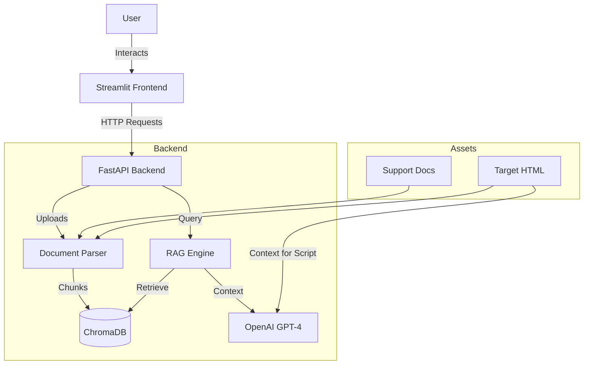

# Autonomous QA Agent

An intelligent, autonomous QA agent capable of constructing a "testing brain" from project documentation. It ingests support documents and HTML structure to generate comprehensive test cases and executable Selenium scripts.

## 🏗️ Architecture

The system is built using a modular architecture separating the frontend, backend, and knowledge engine.



### Key Components
1.  **Frontend (Streamlit)**: Provides an intuitive interface for uploading files, managing the knowledge base, and interacting with the agents.
2.  **Backend (FastAPI)**: Handles API requests, file processing, and orchestrates the AI logic.
3.  **Knowledge Engine (LangChain + ChromaDB)**:
    *   **Ingestion**: Parses Markdown, JSON, and Text files.
    *   **Storage**: Vectorizes content using OpenAI Embeddings and stores it in ChromaDB.
    *   **Retrieval**: Uses RAG (Retrieval-Augmented Generation) to fetch relevant context for test case generation.
4.  **LLM (OpenAI GPT-4)**: Generates human-readable test plans and executable Python Selenium code.

## 🚀 Getting Started

### Prerequisites
*   Python 3.9+
*   OpenAI API Key

### Installation

1.  **Clone the repository**:
    ```bash
    git clone <repository-url>
    cd OCEANAI
    ```

2.  **Setup Environment**:
    Run the setup script to install dependencies:
    ```bash
    cd qa_agent
    ./setup.sh
    ```

3.  **Configure API Key**:
    Open `qa_agent/.env` and add your OpenAI API Key:
    ```env
    OPENAI_API_KEY=sk-your-key-here
    ```

## 🏃 Usage

### 1. Start the Backend
In a terminal window:
```bash
cd qa_agent
./run_backend.sh
```
The API will start at `http://localhost:8000`.

### 2. Start the Frontend
In a new terminal window:
```bash
cd qa_agent
./run_frontend.sh
```
The UI will open at `http://localhost:8501`.

### 3. Workflow
1.  **Build Knowledge Base**: Upload `product_specs.md`, `ui_ux_guide.txt`, `api_endpoints.json` (found in `qa_agent/assets`) and the target `checkout.html`.
2.  **Generate Test Cases**: Ask the agent to generate test cases (e.g., "Generate tests for the discount feature").
3.  **Generate Scripts**: Select a test case and generate the corresponding Selenium script.

## 📂 Project Structure

```
OCEANAI/
├── LICENSE                 # MIT License
├── README.md               # Project Documentation
├── .gitignore
└── qa_agent/               # Main Application Directory
    ├── .env                # Environment Variables
    ├── requirements.txt    # Python Dependencies
    ├── setup.sh            # Setup Script
    ├── run_backend.sh      # Backend Startup Script
    ├── run_frontend.sh     # Frontend Startup Script
    ├── assets/             # Sample Project Assets
    ├── backend/            # FastAPI & RAG Logic
    └── frontend/           # Streamlit UI
```

## 📄 License

This project is licensed under the MIT License - see the [LICENSE](LICENSE) file for details.
